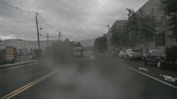

## Physics-aware guided disentanglement for generative networks (T-PAMI 2023)

This repository contains the implementation of our paper published at T-PAMI and ECCV. In short, we learn to disentangle visual traits and generate them in a complementary manner by combining the learning capabilities of GANs with realistic physical models.

We are then able to obtain high quality results like these:




### Abstract

Image-to-image translation (i2i) networks suffer from entanglement effects in presence of physics-related phenomena in the target domain (such as occlusions, fog, etc), lowering altogether the translation quality, controllability and variability. In this paper, we build upon a collection of simple physics models and present a comprehensive method for disentangling visual traits in target images, guiding the process with a physical model that renders some of the target traits, and learning the remaining ones. Because it allows explicit and interpretable outputs, our physical models (optimally regressed on target) allows generating unseen scenarios in a controllable manner. We also extend our framework, showing versatility to neural-guided disentanglement. The results show our disentanglement strategies dramatically increase performances qualitatively and quantitatively in several challenging scenarios for image translation.

### Method


### Installation

This repository contains the code for inference to reproduce our results on rain generation.

To install our code, clone the repository and run the following command:

```
pip install -r requirements.txt
```

Then, download the pertained weights and move them to the `weights` directory:

```
TODO
```

### Usage

To use our method, simply launch the gradio app included in the repo.

```
python app_gradio.py
```

In there, you can modify parameters of the injected raindrops and obtain composite outputs with wetness generated by the GAN, and raindrops generated by the physical model. We also show the disentangled output (wetness-only).

### References

If you use our method in your research, please cite our papers:

```
@article{pizzati2023physics,
  title={Physics-informed Guided Disentanglement in Generative Networks},
  author={Pizzati, Fabio and Cerri, Pietro and de Charette, Raoul},
  journal={IEEE Transactions on Pattern Analysis and Machine Intelligence},
  year={2023},
  publisher={IEEE}
}

@inproceedings{pizzati2020model,
author="Pizzati, Fabio
and Cerri, Pietro
and de Charette, Raoul",
title="Model-Based Occlusion Disentanglement for Image-to-Image Translation",
booktitle="European Conference on Computer Vision",
year="2020"
}

```
